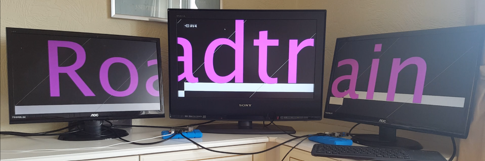

.. AAIP Roadtrain Project documentation master file, created by
   sphinx-quickstart on Thu Sep  2 13:53:54 2021.
   You can adapt this file completely to your liking, but it should at least
   contain the root `toctree` directive.

AAIP Roadtrain Project documentation.
==================================================

Contents:
=========

.. toctree::
   :maxdepth: 2
   :caption: Installation:

   Installation

.. toctree::
   :maxdepth: 2
   :caption: Configuration:

   Configuration

.. toctree::
   :maxdepth: 2
   :caption: Running:

   Running

.. toctree::
   :maxdepth: 2
   :caption: Code:

   code/modules

Indices and tables
==================

* :ref:`genindex`
* :ref:`modindex`
* :ref:`search`
